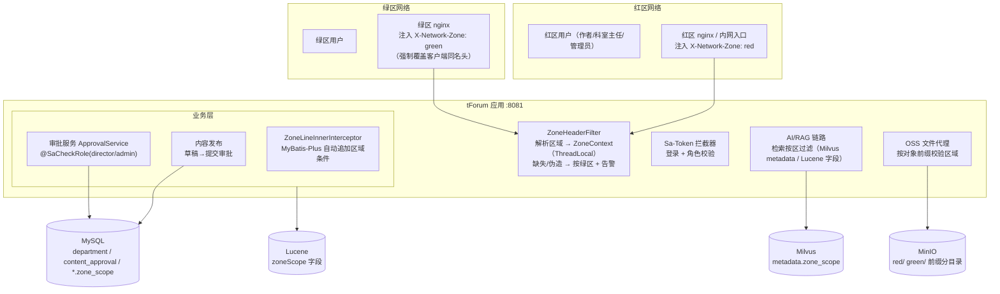
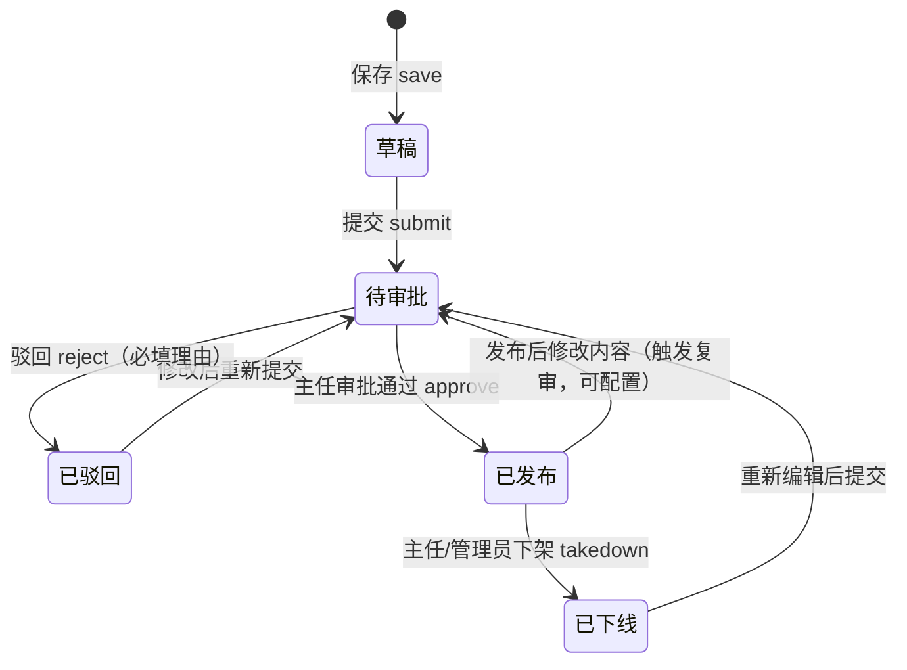
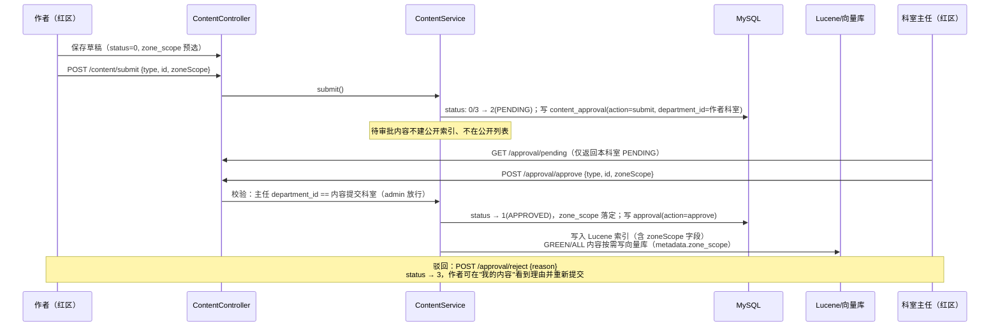
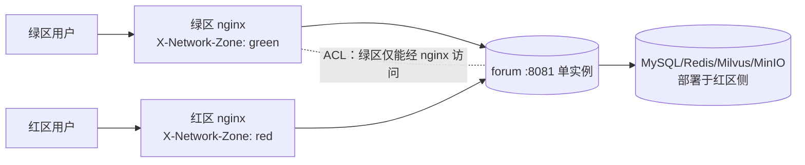

# tForum 架构后续优化方案：内容审批流 与 红/绿区内容可见性

> 版本：v1.0
> 日期：2026-09-03
> 配套文档：《架构设计文档.md》（现状梳理）
> 涉及模块：user（角色/组织）、forum（内容/审批）、common（分区上下文/AI）、search（Lucene）、oss（文件代理）、mcp（AI 工具）

---

## 1. 背景与目标

### 1.1 业务需求

1. **新增"科室主任"角色**：用户归属于科室；科室主任负责对本科室成员发布的内容进行审批。
2. **发布审批制**：文章等内容（文章、帖子、图书、Skill、Markdown 文档）发布前必须经科室主任审批通过；驳回需填写理由，作者可修改后重新提交。
3. **网络分区可见性（红区/绿区）**：每条内容需标注可浏览的网络区域；系统根据请求来源区域自动过滤内容。区域识别方式：**绿区 nginx 代理在转发时注入一个 HTTP Header**，后端据此判定请求来源。

### 1.2 术语与假设

| 术语 | 定义 |
|---|---|
| **绿区** | 对外/低密网络区域（如互联网、协作外网）。用户经**绿区 nginx** 访问，该代理强制注入区域 Header。绿区可见内容最少。 |
| **红区** | 内部/高密网络区域（如院内办公网）。经红区入口访问。内部敏感内容默认仅红区可见。 |
| **内容区域属性 `zone_scope`** | `GREEN`（仅绿区可见）、`RED`（仅红区可见）、`ALL`（两区均可见） |

> ⚠️ 红/绿区的具体密级定义以贵单位网络安全制度为准，本方案不改变密级语义，只提供"按区过滤"的技术机制。**默认策略为最小可见（fail-closed）**：无法确认来源区域的请求按绿区处理，绝不展示红区内容。

**部署假设**（两种模式均支持，详见第 8 节）：

- **模式 A：逻辑分区（推荐先落地）**——一套后端、一套数据库，红/绿区各有一个 nginx 入口，靠 Header 区分；网络 ACL 保证绿区用户无法绕过 nginx 直连后端。
- **模式 B：物理隔离**——红区/绿区各部署独立实例与数据库，红区为内容主数据源，审批通过的 `GREEN/ALL` 内容经单向同步（网闸/数据交换）下发绿区。

---

## 2. 总体方案



两条主线：

- **审批流**：在现有内容表上扩展状态机（草稿→待审批→已发布/已驳回），新增科室表与审批记录表；科室主任角色绑定科室数据权限。
- **分区可见性**：nginx 注入 Header → 过滤器解析为请求级 `ZoneContext` → 在 **MySQL 查询、Lucene 检索、Milvus 向量检索、OSS 文件代理、AI 工具调用** 五个出口统一按区过滤，防止任何一个通道泄露红区内容。

---

## 3. 组织与角色模型

### 3.1 新增科室表

```sql
CREATE TABLE IF NOT EXISTS `department` (
    `id` BIGINT NOT NULL AUTO_INCREMENT COMMENT '科室ID',
    `name` VARCHAR(100) NOT NULL COMMENT '科室名称',
    `code` VARCHAR(50) DEFAULT NULL COMMENT '科室编码',
    `parent_id` BIGINT DEFAULT 0 COMMENT '上级科室（预留科室层级）',
    `sort_order` INT DEFAULT 0,
    `status` VARCHAR(20) DEFAULT 'active' COMMENT 'active/disabled',
    `created_time` DATETIME NOT NULL,
    `updated_time` DATETIME DEFAULT NULL,
    `is_deleted` TINYINT(1) DEFAULT 0,
    PRIMARY KEY (`id`),
    UNIQUE KEY `uk_code` (`code`)
) ENGINE=InnoDB COMMENT='科室表';
```

`system_user` 表扩展：

```sql
ALTER TABLE `system_user`
    ADD COLUMN `department_id` BIGINT DEFAULT NULL COMMENT '所属科室ID' AFTER `role`;
ALTER TABLE `system_user`
    ADD KEY `idx_department_id` (`department_id`);
```

### 3.2 角色模型

保持现有 `role` 单字符串列不变（避免大改），角色取值扩展为：

| role | 含义 | 数据权限 |
|---|---|---|
| `admin` | 系统管理员 | 全院内容审批、用户/科室管理、后台配置 |
| `director` | 科室主任 | **仅本科室成员提交的内容**可审批；自身也可发文 |
| `user` | 普通用户 | 发文、提交审批、浏览有权限的内容 |

- 主任归属科室取 `system_user.department_id`；主任的审批数据范围 = 作者的 `department_id` 与主任相同。
- `StpInterfaceImpl.getRoleList()` 已从 `user.role` 读取，天然支持新角色值，无需改权限源；审批接口用 Sa-Token 注解校验：

```java
@SaCheckRole(value = {"director", "admin"}, mode = SaMode.OR)
@PostMapping("/approval/approve")
public ResponseWrapper<?> approve(...) { ... }
```

> 前置依赖：现状 `SaTokenInterceptorConfig` 中 `/admin/**` 的 `checkRole("admin")` 被注释、管理权限靠手写 `checkAdmin()`。本次应**一并启用注解式角色校验**（注册 `SaInterceptor` 时开启 `SaStrategy` 注解支持，Sa-Token 默认扫描 `@SaCheckRole`），替换手写判断，避免审批接口权限遗漏。

### 3.3 管理接口

| 接口 | 角色 | 说明 |
|---|---|---|
| `POST /api/v1/admin/department/save` `delete` `list` | admin | 科室维护 |
| `POST /api/v1/admin/user/assignDirector` `{userId, departmentId}` | admin | 任命/取消主任（设置 role + department_id） |
| `GET /api/v1/department/list` | 登录用户 | 科室下拉（发文归属、筛选） |

---

## 4. 内容审批工作流

### 4.1 内容状态机

以文章为例（`article.status` 现状为 `0=草稿,1=已发布`），扩展为：



| status 值 | 含义 | 绿/红区公开列表可见 |
|---|---|---|
| 0 | 草稿 DRAFT | 否（仅作者本人） |
| 1 | 已发布 APPROVED | 是（再经区域过滤） |
| 2 | 待审批 PENDING | 否（作者可见"审核中"，主任可见待办） |
| 3 | 已驳回 REJECTED | 否（作者可见驳回理由） |
| 4 | 已下线 OFFLINE | 否 |

> 帖子、图书、Skill、Markdown 文档使用同一套状态语义（各表 `status` 列对齐）；帖子是否纳入审批可按业务开关配置（如 `app.approval.enabled-types=article,book,skill,markdown,post`）。

### 4.2 审批记录表

```sql
CREATE TABLE IF NOT EXISTS `content_approval` (
    `id` BIGINT NOT NULL AUTO_INCREMENT,
    `content_type` VARCHAR(20) NOT NULL COMMENT 'article/post/book/skill/markdown',
    `content_id` BIGINT NOT NULL COMMENT '内容主键',
    `title_snapshot` VARCHAR(255) DEFAULT NULL COMMENT '提交时标题快照（列表展示用）',
    `submitter_id` BIGINT NOT NULL COMMENT '提交人',
    `department_id` BIGINT DEFAULT NULL COMMENT '提交时所属科室（主任数据范围依据）',
    `approver_id` BIGINT DEFAULT NULL COMMENT '审批人',
    `action` VARCHAR(20) NOT NULL COMMENT 'submit/approve/reject/takedown/resubmit',
    `reason` VARCHAR(1000) DEFAULT NULL COMMENT '驳回/下架理由',
    `zone_scope` VARCHAR(10) DEFAULT 'RED' COMMENT '本次申请的可见区域 GREEN/RED/ALL，审批时可调整',
    `created_time` DATETIME NOT NULL,
    PRIMARY KEY (`id`),
    KEY `idx_pending` (`content_type`, `action`, `department_id`),
    KEY `idx_content` (`content_type`, `content_id`)
) ENGINE=InnoDB COMMENT='内容审批流水表';
```

内容表统一增加区域字段：

```sql
ALTER TABLE `article`      ADD COLUMN `zone_scope` VARCHAR(10) NOT NULL DEFAULT 'RED' COMMENT '可见区域 GREEN/RED/ALL' AFTER `status`;
ALTER TABLE `forum_post`   ADD COLUMN `zone_scope` VARCHAR(10) NOT NULL DEFAULT 'RED' AFTER `status`;
-- book / skill / markdown_doc 同（book、skill 无 status 列的一并补上 status）
```

### 4.3 审批时序



**关键规则**：

1. **索引时机后移**：现状文章/帖子/Markdown 保存即写 Lucene 索引。审批制下改为**审批通过时才写公开索引**；驳回/下架时**从索引删除**。这要求补齐 search 模块目前缺失的"按 id 删除/更新文档"能力（现状 `Indexer` 只有 addDocument/clearAll，重复写入产生重复文档——见《架构设计文档》问题 #6，本次一并解决：`IndexWriter.deleteDocuments(new Term("id", ...))` + `updateDocument`）。
2. **发布后修改触发复审**：已发布内容被作者再次编辑，status 回退为 PENDING（旧版本仍在线？建议：编辑期间保留旧版本在线，审批通过后替换；实现上可简单化为编辑即下架重审，由业务开关决定）。
3. **区域由审批确定**：作者提交时预选 `zoneScope`（默认 RED，最小可见），主任审批时可调整（如把适合对外宣传的内容改为 GREEN/ALL）。`GREEN` 内容意味着将在绿区/互联网可见，主任审批即承担密级确认责任，审批页需显著提示。
4. **审批人数据范围**：`pending` 列表 SQL 追加 `department_id = 当前主任.departmentId`；admin 看全部。

### 4.4 接口清单

| 接口 | 角色 | 说明 |
|---|---|---|
| `POST /api/v1/content/submit` | 作者 | `{contentType, id, zoneScope}` 草稿/驳回 → 待审批 |
| `GET /api/v1/approval/pending?contentType&pageNum&pageSize` | director/admin | 待审批列表（主任限本科室） |
| `GET /api/v1/approval/records?contentType&contentId` | director/admin/作者 | 审批流水（审批痕迹/作者看驳回理由） |
| `POST /api/v1/approval/approve` | director/admin | `{contentType, id, zoneScope}` 通过 |
| `POST /api/v1/approval/reject` | director/admin | `{contentType, id, reason}` 驳回（reason 必填，后端校验） |
| `POST /api/v1/approval/takedown` | director/admin | 已发布内容下架 |
| `GET /api/v1/approval/pendingCount` | director | 待办角标数量 |

> 通知：一期用"待办数量 + 列表轮询/页面刷新"满足；二期可复用已实现的 `EmailSendMcpService`（内网 SMTP）或新增站内消息表做审批通知。

---

## 5. 红/绿区内容可见性设计

### 5.1 nginx 入口注入 Header

**绿区 nginx**（对外入口）：

```nginx
location /api/ {
    # 强制覆盖：无论客户端是否伪造该头，一律以代理设定为准
    proxy_set_header X-Network-Zone "green";
    proxy_set_header X-Forwarded-For $proxy_add_x_forwarded_for;
    proxy_pass http://forum-backend:8081;
}
```

**红区入口**（内网 nginx，或内网直连入口的统一代理）：

```nginx
location /api/ {
    proxy_set_header X-Network-Zone "red";
    proxy_pass http://forum-backend:8081;
}
```

要点：

- `proxy_set_header` 会**覆盖**客户端传入的同名头，用户无法在浏览器侧伪造 `X-Network-Zone: red` 提权。
- 后端服务器只对 nginx 所在网段开放（防火墙/安全组 ACL），绿区用户无法绕过代理直连 8081。
- 前端静态资源同理由两区 nginx 分别托管（同一套 dist 即可，UI 按第 5.6 节自适应）。

### 5.2 后端区域解析：ZoneHeaderFilter

common 模块新增区域上下文：

```java
public enum Zone { GREEN, RED }

public final class ZoneContext {
    private static final ThreadLocal<Zone> CURRENT = new ThreadLocal<>();
    public static Zone get() {            // 缺失时默认 GREEN（最小可见）
        Zone z = CURRENT.get();
        return z != null ? z : Zone.GREEN;
    }
    static void set(Zone z) { CURRENT.set(z); }
    static void clear() { CURRENT.remove(); }
}
```

```java
@Component
public class ZoneHeaderFilter extends OncePerRequestFilter {
    // 仅信任来自可信代理网段的请求（配置 app.zone.trusted-proxy-cidrs）
    // 1. 读取 X-Network-Zone
    // 2. 值合法(green/red) → 设置 ZoneContext
    // 3. 缺失/非法 → 默认 GREEN，并 log.warn 记录（可能是直连或伪造）
    // 4. finally 中 ZoneContext.clear()
}
```

**安全细节**：

- 默认值取 **GREEN**（最小可见原则）：任何未经红区代理确认的请求，都看不到 RED 内容。
- 可选增强：校验 `request.getRemoteAddr()` 属于可信代理网段，非可信来源带 `red` 头时拒绝并告警（防内网横向伪造）。
- SSE（AI 聊天）与普通 HTTP 同一过滤器链，`ZoneContext` 对 Flux 异步线程需在订阅时透传（可用 `ContextSnapshot` 或在 Controller 入口先取出 Zone 再传入 service）。

### 5.3 MySQL 自动过滤：MyBatis-Plus 区域拦截器

参照多租户插件思路，实现 `ZoneLineInnerInterceptor`（MyBatis-Plus `InnerInterceptor`），对配置的内容表（article/forum_post/book/skill/markdown_doc）**自动追加** WHERE 条件：

```java
// 当前区域 GREEN → zone_scope IN ('GREEN','ALL') AND status = 1
// 当前区域 RED   → zone_scope IN ('RED','ALL')  AND status = 1
```

- 拦截 `SELECT` 语句，按表名配置（`app.zone.tables=article,forum_post,book,skill,markdown_doc`）自动拼条件；
- **管理端/作者本人/审批接口不受限**：通过线程内开关绕过（如 `ZoneScopeExclude.runWithoutZoneFilter(() -> ...)`），仅在"我的内容""审批待办""后台管理"等服务方法中显式使用，默认全部强制过滤——避免开发时遗漏。
- 相比在每个 Service 手写 wrapper 条件，拦截器方案的防遗漏性最好（新增查询默认即合规）。

### 5.4 搜索与 AI 链路过滤

| 通道 | 过滤方式 |
|---|---|
| **Lucene 全文检索** | `IndexedDocument` 增加 `zoneScope` 字段（StringField 精确匹配）；Indexer 写入时带上；Querier 的 BooleanQuery 追加 `TermQuery(zoneScope, 当前区)` + ALL（用 `TermsQuery`/BooleanQuery SHOULD）。**title 字段同时改 TextField**（现状标题不分词，见问题 #6） |
| **Milvus 向量检索（RAG）** | 文档入库 metadata 增加 `zone_scope`；检索时 `SearchRequest.filterExpression("zone_scope == 'ALL' or zone_scope == '<当前区>'")`。防止红区知识库内容在绿区 RAG 问答中泄露 |
| **AI 工具调用（mcp）** | `SearchMcpService.fuzzySearch` 等 @Tool 方法通过 Spring AI `ToolContext` 接收当前 Zone（Controller 调用 chat 时传入 `ToolContext.of("zone", zone)`），工具内部按区过滤；红区专属工具（SSH 等）在绿区上下文中不注册/不挂载 |
| **AI 对话记忆** | 红区对话内容不进入绿区可见的知识库；RAG 入库（文档上传、文章入向量库）仅接受 APPROVED 且区域匹配的内容 |
| **Redis 缓存** | `@RedisCache` 的 key 现状为"应用名+name+参数MD5"。区域过滤生效后，**zone 必须进入缓存 key**（修复 AOP 切点后，建议 key 中拼接 `ZoneContext.get()`，或在业务参数中显式带 zone），否则红/绿区会串缓存 |

### 5.5 OSS 文件的区域管控（重点防泄漏口）

现状文件经 `/api/v1/oss/file?url=...` 后端流式代理，但**只要拿到 URL 就能下载**，红区内容的 PDF/图片可能被绿区直接访问。方案：

1. **对象键按区前缀分目录**：上传时按内容区域决定前缀，`green/`、`red/`（及 `all/` 公共静态资源）：
   - 图书：`red/books/...`、`green/books/...`；文章图片同理；
   - 审批通过且 `zone_scope=GREEN/ALL` 的内容，其附件路径落在绿区可访问前缀。
2. **代理校验**：`OssController.proxyFile` 在 `resolveBucketAndObject` 后，解析 objectKey 首段前缀：
   - `green/` 前缀：两区均可访问（绿区内容本就公开）；
   - `red/` 前缀：仅 `ZoneContext.get() == RED` 且已登录可访问，否则 403；
   - 无法识别前缀的历史对象：默认按 `red/` 处理（fail-closed），兼容期内人工迁移。
3. 内容区域变更（主任审批时调整 zoneScope）涉及附件迁移：审批服务调用 OSS 的 `copyObject` 到新前缀 + 删除旧对象（MinIO 支持服务端拷贝）。

### 5.6 前端配合

- 新增 `GET /api/v1/system/zone`：返回 `{zone: "green"|"red"}`（过滤器同源逻辑）。前端启动时拉取：
  - 绿区：隐藏"投稿/审批后台/科室管理"等入口与导航项，只读浏览；
  - 红区：展示完整功能（写作、提交审批、主任待办角标）。
- 写作页提交时增加"可见区域"选择（默认"仅红区"，GREEN/ALL 选项加二次确认提示"将在外部网络可见"）。
- "我的内容"列表展示状态徽章：草稿/审核中/已驳回（含理由）/已发布/已下线。
- 新增主任审批页（`views/director/ApprovalCenter.vue`）：待审批列表、内容预览、通过（可选调整区域）/驳回（理由必填）。
- 前端隐藏仅为体验优化，**一切以过滤器/拦截器/代理校验为准**。

---

## 6. 数据库变更汇总

```sql
-- 1. 科室
CREATE TABLE IF NOT EXISTS `department` ( ... );  -- 见 3.1

-- 2. 用户归属科室
ALTER TABLE `system_user` ADD COLUMN `department_id` BIGINT DEFAULT NULL AFTER `role`;
ALTER TABLE `system_user` ADD KEY `idx_department_id` (`department_id`);

-- 3. 审批流水
CREATE TABLE IF NOT EXISTS `content_approval` ( ... );  -- 见 4.2

-- 4. 各内容表：区域字段 + 状态对齐
ALTER TABLE `article`      ADD COLUMN `zone_scope` VARCHAR(10) NOT NULL DEFAULT 'RED' AFTER `status`;
ALTER TABLE `forum_post`   ADD COLUMN `zone_scope` VARCHAR(10) NOT NULL DEFAULT 'RED';
ALTER TABLE `book`         ADD COLUMN `status` INT NOT NULL DEFAULT 0 COMMENT '0待审 1已发布 3驳回 4下线',
                           ADD COLUMN `zone_scope` VARCHAR(10) NOT NULL DEFAULT 'RED';
ALTER TABLE `skill`        ADD COLUMN `zone_scope` VARCHAR(10) NOT NULL DEFAULT 'RED' AFTER `status`;
ALTER TABLE `markdown_doc` ADD COLUMN `zone_scope` VARCHAR(10) NOT NULL DEFAULT 'RED';

-- 5. 存量数据迁移：历史已发布内容默认全部按红区可见（最小可见），由主任后续逐条调整
UPDATE `article`    SET `zone_scope` = 'RED' WHERE `status` = 1;
-- 其余表同理
```

---

## 7. 代码改动清单

| 模块 | 改动 |
|---|---|
| user | `Department` 实体/Mapper/Service；`User` 增加 `departmentId`；`StpInterfaceImpl` 无需改（role 列已支持）；启用 `@SaCheckRole` 注解拦截 |
| forum | `ApprovalService`/`ApprovalController`（提交/审批/驳回/待办/流水）；各 ContentService 接入状态机（submit/approve/reject 钩子）；`department` 管理接口；`SystemController.zone()` |
| common | `Zone` 枚举、`ZoneContext`、`ZoneHeaderFilter`；`ZoneLineInnerInterceptor`（注册到 MybatisPlusInterceptor）；Milvus 检索 filterExpression 拼装；缓存 key 拼接 zone |
| search | `IndexedDocument` 增加 `zoneScope`；Indexer 支持 `updateDocument/deleteDocument(id)`；title 改 TextField；Querier 按区 BooleanQuery |
| oss | 上传按区前缀（`red/`、`green/`）；`proxyFile` 前缀校验 + 403；跨区 copyObject 迁移工具 |
| mcp | `SearchMcpService` @Tool 方法增加 ToolContext 取 zone 并过滤；绿区上下文不挂载高危工具 |
| 前端 | 系统区域探测、审批中心页、写作页区域选择、状态徽章、绿区 UI 裁剪 |

---

## 8. 部署模式

### 模式 A：逻辑分区（单实例双入口，推荐一期）



- 要求：后端与全部数据组件部署在红区侧；绿区 nginx 与后端之间为受控代理通道；网络 ACL 禁止绿区直连 8081/9000/19530 等端口。
- 优点：改动小、无数据同步、审批实时生效。
- 局限：绿区到红区后端存在网络通道，需通过单位网安评审（密级高的场景可能不允许）。

### 模式 B：物理隔离（双实例 + 单向同步，二期按合规要求）

- 红区部署完整一套（forum + MySQL + Redis + Milvus + MinIO + Lucene），为内容生产/审批主环境。
- 绿区独立部署一套，仅承载浏览。
- 同步链路：审批通过且 `zone_scope IN ('GREEN','ALL')` 的内容（含附件、索引、向量）经**单向网闸/数据交换**定期同步到绿区；`RED` 内容永不流出。可用项目已引入的 **Spring Batch** 实现同步任务（导出 → 网闸摆渡 → 导入重建 Lucene/Milvus 索引）。
- 绿区实例关闭所有写接口与管理接口（nginx 层仅放行 GET 只读路由）。

---

## 9. 安全检查清单（防泄漏）

| # | 检查点 | 措施 |
|---|---|---|
| 1 | Header 伪造 | nginx `proxy_set_header` 强制覆盖；后端默认 GREEN；可选代理网段校验 + 直连告警 |
| 2 | 数据库列表 | `ZoneLineInnerInterceptor` 默认强制追加区域条件，绕过需显式开关且仅限审批/管理场景 |
| 3 | 全文搜索 | Lucene 查询必带 zoneScope 条件；审批通过才建索引、下架即删 |
| 4 | RAG/向量 | Milvus metadata 过滤表达式；仅 APPROVED 内容可入库；红区文档不向绿区问答泄露 |
| 5 | AI 工具 | ToolContext 透传 zone；绿区不挂载 SSH/邮件等内网工具 |
| 6 | 文件下载 | OSS 代理按对象前缀校验；红区前缀绿区 403；历史对象 fail-closed |
| 7 | 缓存串区 | Redis 缓存 key 包含 zone |
| 8 | 审批越权 | 主任仅能审批本科室内容（SQL 数据范围 + 服务校验双保险）；驳回理由必填留痕 |
| 9 | 密级确认 | GREEN/ALL 发布由主任审批确认，UI 显著提示"外网可见"；审批流水完整审计 |
| 10 | 前端绕过 | 前端隐藏入口仅为体验，所有写/管理接口后端独立鉴权（@SaCheckRole + 拦截器） |

---

## 10. 实施计划

| 阶段 | 内容 | 依赖/前置 |
|---|---|---|
| **P0 前置修复** | 修复 AOP 切点包名（缓存/锁/限流生效）；启用 Sa-Token 注解式角色校验；Lucene 补齐 update/delete 能力、title 改 TextField | 《架构设计文档》问题 #1、#6、#7 |
| **P1 审批流** | department 表与管理；角色 director + 科室数据权限；content_approval 与状态机（先接文章，再接 book/skill/markdown/post）；审批中心前端 | P0 |
| **P2 分区可见性** | nginx Header 注入；ZoneHeaderFilter + ZoneContext；MyBatis 区域拦截器；`/system/zone` 与前端裁剪 | P1（内容有 zone_scope） |
| **P3 全链路收口** | Lucene/Milvus 按区过滤；OSS 前缀管控与跨区迁移；AI 工具 ToolContext；缓存 key 带 zone | P2 |
| **P4 合规增强（按需）** | 审批邮件/站内通知；物理隔离双实例 + Spring Batch 单向同步；绿区只读模式 | 单位网安要求 |

---

## 11. 关键设计权衡

1. **默认区域取 GREEN（最小可见）而非"无标识即红区"**：红区内容敏感，宁可让内网直连的异常请求看不到内容（可由运维排查），也不让伪造请求读到红区数据。
2. **区域过滤用 MyBatis 拦截器而非 Service 手写条件**：内容查询点分散（文章/帖子/图书/Skill/文档/后台），默认强制、显式绕过的机制防遗漏，等价于把"区域"当第二个租户维度。
3. **审批通过才建搜索/向量索引**：保证待审/驳回内容不会通过搜索或 RAG 泄露；代价是需补齐 Lucene 增量删除能力（本就是已知欠账）。
4. **角色保持单字符串 + 科室列**：不引入完整 RBAC 表体系，贴合当前 `StpInterfaceImpl` 实现，改动最小；未来若权限点变多再升级 role/permission 关联表。
5. **文件管控用对象前缀而非文件元数据表**：MinIO 对象键即标签，代理层一次解析即可判定，无需额外建表与一致性维护；跨区迁移用服务端 copy。
6. **逻辑分区先行、物理隔离预留**：多数内网场景单实例 + ACL 即可满足；同步通道基于已有的 Spring Batch 依赖预留，避免过度设计。
