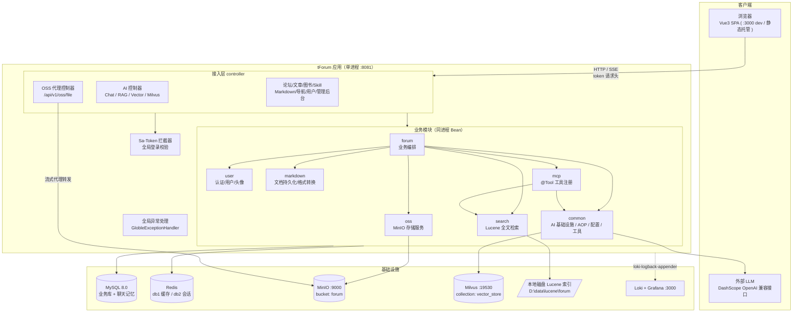
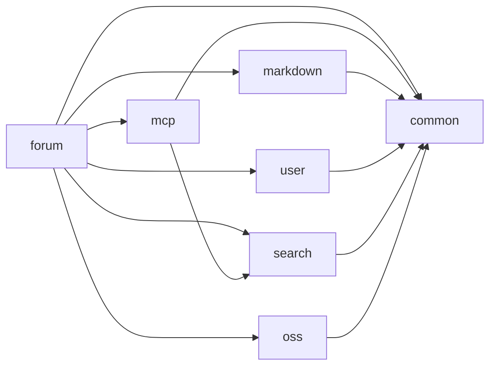
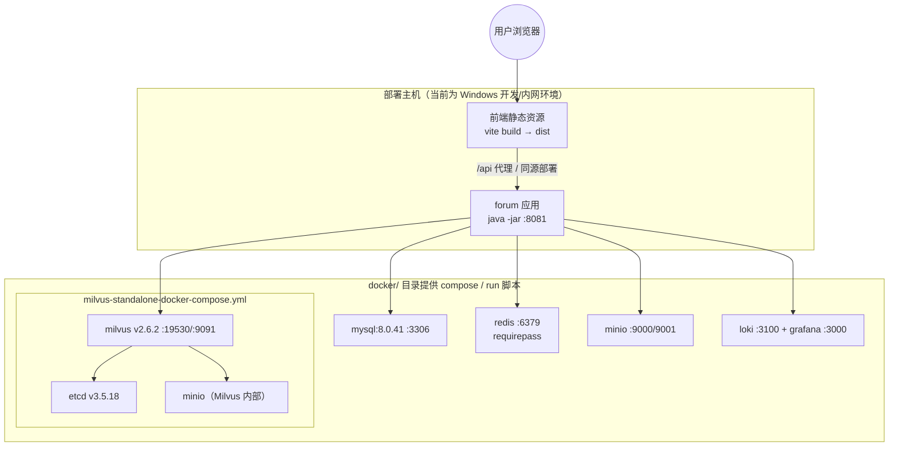
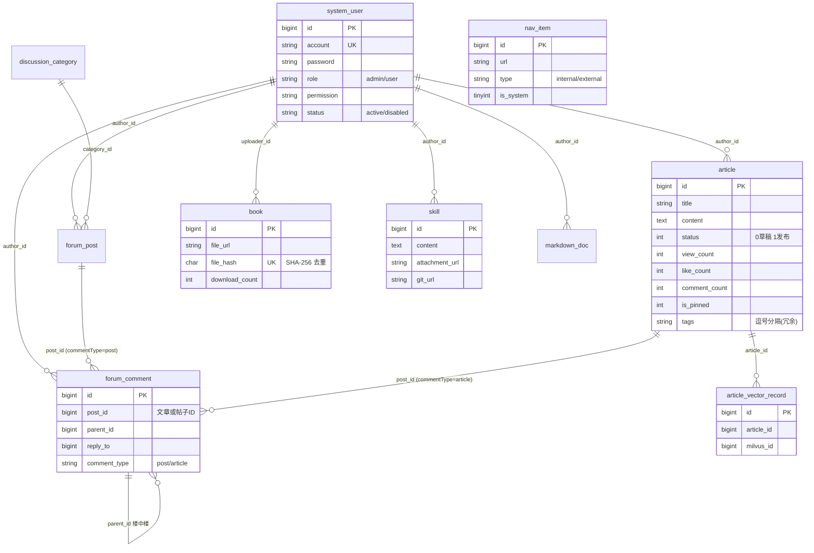
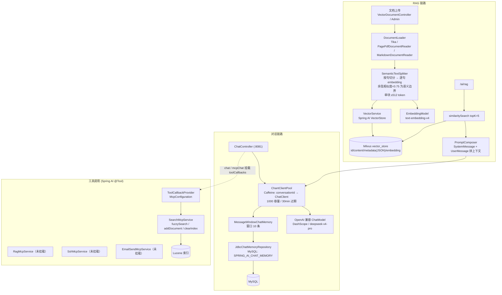
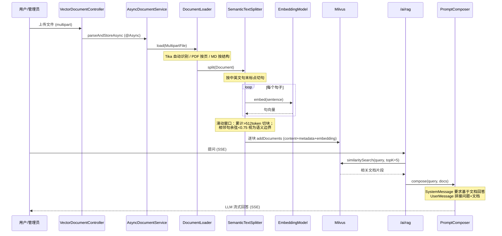
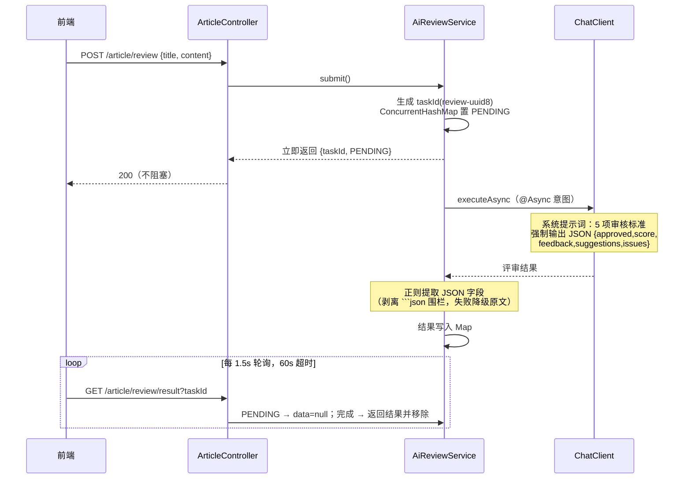
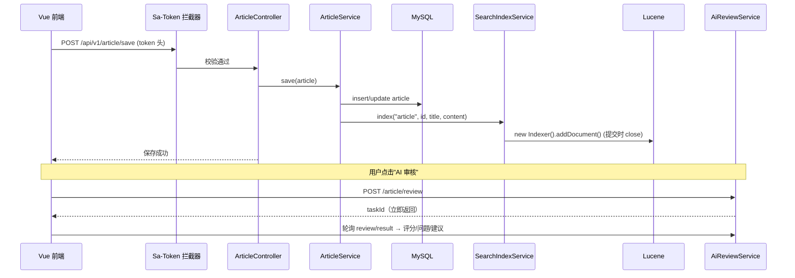
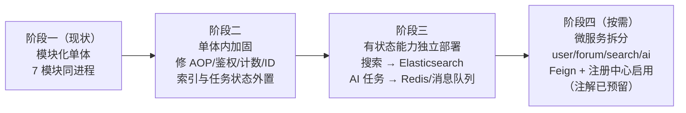

# tForum（coleditor）架构设计文档

> 版本：v1.0（基于当前代码库梳理）
> 日期：2026-09-03
> 范围：后端 7 个 Maven 模块 + Vue3 前端 + 基础设施（MySQL / Redis / MinIO / Milvus / Lucene）

---

## 1. 项目概述

tForum 是一个以**技术社区/论坛**为载体、深度集成 **AI 能力（对话 / RAG / 内容审核 / 工具调用）** 的内容平台。核心功能包括：

- **社区内容**：讨论区帖子与楼中楼评论、技术文章（草稿/发布/点赞/置顶/标签）、图书角（PDF 分享）、Skills 技能分享、Markdown 文档库
- **AI 能力**：多轮对话（SSE 流式）、RAG 知识库问答（Milvus 向量检索）、文章 AI 审核（异步任务 + 轮询）、LLM 工具调用（Lucene 全文搜索作为 Tool）
- **双轨搜索**：Lucene 中文全文检索（关键词）+ Milvus 语义向量检索（RAG）
- **平台管理**：用户/角色、内容审核后台、导航栏动态配置、Milvus 知识库管理
- **文件服务**：MinIO 对象存储 + 后端流式代理（隐藏存储真实地址）

**定位判断**：代码按多模块 Maven 工程组织，开启了 `@EnableDiscoveryClient` / `@EnableFeignClients`，但所有模块以 jar 依赖被 `forum` 启动模块聚合扫描，**实际部署形态为"模块化单体"（Modular Monolith）**，微服务注解为未来拆分预留。

---

## 2. 技术栈

| 层次 | 技术选型 | 版本 | 用途 |
|---|---|---|---|
| 语言/运行时 | Java | 21 | 后端 |
| 框架 | Spring Boot | 3.5.7 | 主框架 |
| 微服务套件 | Spring Cloud | 2025.0.0 | OpenFeign / LoadBalancer / Resilience4j（**当前未实际使用远程调用**） |
| AI 框架 | Spring AI | 1.0.3 | ChatClient、VectorStore、RAG、MCP Tool Calling、Chat Memory |
| ORM | MyBatis-Plus | 3.5.14 | 数据访问、逻辑删除、分页 |
| 认证 | Sa-Token | 1.44.0 | 登录鉴权、角色权限、Redis 持久化 |
| 数据库 | MySQL | 8.0 | 主数据库（InnoDB） |
| 缓存 | Redis | latest | 业务缓存（db1）、Sa-Token 独立库（db2） |
| 向量库 | Milvus | 2.6.2 standalone | RAG 向量存储与相似度检索 |
| 全文检索 | Lucene | 10.3.2 + IK 分词 5.1.0 | 本地磁盘全文索引 |
| 对象存储 | MinIO | 8.6.0 SDK | 图片/PDF/附件存储 |
| 文档处理 | Apache Tika / POI 5.5.1 / commonmark 0.27 / jsoup | — | PDF/DOCX/Markdown/HTML 解析与转换 |
| 本地缓存 | Caffeine | 3.2.3 | ChatClient 会话池 |
| 日志 | Logback + Loki appender | 1.5.20 / 2.0.0 | 日志输出 + Loki 聚合 |
| API 文档 | springdoc-openapi | 2.8.13 | Swagger UI |
| 前端 | Vue 3.5 + TypeScript + Vite 6 | — | SPA |
| 前端 UI | Element Plus 2.9 + Pinia + Vue Router | — | 组件库/状态/路由 |
| 前端编辑器 | md-editor-v3 + marked + highlight.js + mermaid + katex | — | Markdown 写作与渲染 |

---

## 3. 总体架构

### 3.1 系统架构图



### 3.2 架构风格说明

- **模块化单体**：7 个 Maven 模块各自内聚（包名隔离），编译期依赖、运行期同一 Spring 容器。`forum` 是唯一启动模块（`cc.shiyi.coleditor.forum.Main`），通过：
  - `@ComponentScan(basePackages = {"cc.shiyi"})` 扫描全部模块 Bean；
  - `@MapperScan` 跨模块扫描 `forum.mapper`、`markdown.mapper`、`user.mapper`、`search.db` 四个 Mapper 包；
  - `@EnableAsync` 开启异步；`@EnableFeignClients(basePackages = "cc.shiyi")` / `@EnableDiscoveryClient` 为微服务化预留（**当前代码库无任何 `@FeignClient` 接口**）。
- **模块间通信**：全部为进程内直接 Bean 注入，无网络调用、无消息队列、无 Spring 事件机制。
- **实时通信**：AI 流式输出采用 **SSE（`Flux<String>` + `text/event-stream`）**，未使用 WebSocket。

---

## 4. 模块划分与依赖

### 4.1 模块职责

| 模块 | 包根 | 职责 | 是否有启动类 |
|---|---|---|---|
| `forum` | `cc.shiyi.coleditor.forum` | 启动入口 + 全部 Controller + 业务编排（帖子/评论/文章/图书/Skill/导航/AI 编排/管理后台） | ✅ Main（:8081） |
| `common` | `cc.shiyi.coleditor.common` | AI 基础设施（ChatClient 池、文档加载、语义切分、Milvus 初始化、向量服务）、AOP 注解与切面（缓存/锁/限流/日志）、统一响应、全局异常、Redis/Jackson/WebClient 配置、工具类 | ❌ |
| `user` | `cc.shiyi.coleditor.user` | Sa-Token 配置与拦截器、用户/头像实体与服务、权限数据源 `StpInterfaceImpl` | ❌ |
| `markdown` | `cc.shiyi.coleditor.markdown` | Markdown 文档持久化（`MarkdownDocService`）、`BaseTable` 公共实体基类、DOCX/HTML/Markdown 互转工具 | ❌ |
| `search` | `cc.shiyi.search` | Lucene 索引写入（Indexer）、模糊查询（Querier）、搜索建议（Suggester，未完成）、热词统计 Mapper | ❌ |
| `oss` | `cc.shiyi.oss` | MinIO 客户端配置、上传/下载/删除/列表服务、URL 代理包装与 Jackson 序列化器、文件类型推断 | ❌ |
| `mcp` | `cc.shiyi.mcp` | 基于 Spring AI `@Tool` 的工具注册（全文搜索工具已挂载；RAG/SSH/邮件工具已实现未挂载） | ❌ |

### 4.2 模块依赖关系



> `forum/pom.xml` 聚合全部内部模块；`common` 是最底层共享库；`mcp` 横向依赖 `common`（向量服务）与 `search`（全文检索）。

### 4.3 后端分层约定

```
controller（HTTP 接入，forum 模块）
   └── service（业务逻辑，各模块）
          ├── mapper（MyBatis-Plus，数据访问）
          │     └── table（@TableName 实体）
          └── 跨模块能力：直接 @Autowired 注入其他模块的 Service / 工具类
```

- 统一响应体：`common.http.ResponseWrapper<T>{code, message, data}`，`code=0` 成功、`-1` 失败、`401` 未登录；分页用 `ListWrapper<T>{data, count, pageNum, pageSize}`。
- 实体公共基类 `markdown.table.BaseTable`：`createdTime / updatedTime / creatorId / updaterId / isDeleted`，其中 `isDeleted` 为 `@TableLogic` 逻辑删除。

---

## 5. 部署架构

### 5.1 部署拓扑



- 中间件均以 Docker 脚本方式提供（`docker/*.bat` 与 `milvus-standalone-docker-compose.yml`）。
- Milvus standalone 依赖 etcd（元数据）+ MinIO（对象存储），与业务 MinIO 相互独立。
- Lucene 索引使用**本地文件系统** `FSDirectory`（`lucene.storage.path`，默认 `D:\data\lucene\forum`）——这是多实例部署的主要状态瓶颈。
- 配置全部支持环境变量覆盖（`${REDIS_HOST:127.0.0.1}` 风格），可选配置文件通过 `spring.config.import: optional:classpath:xxx.yml` 按需加载。

### 5.2 端口与配置清单

| 组件 | 端口 | 配置文件 | 关键配置 |
|---|---|---|---|
| forum 应用 | 8081 | `application.yml` | multipart 上限 100MB |
| 前端 dev server | 3000 | vite proxy | `/api` → `localhost:8081` |
| MySQL | 3306 | `mysql.yml` | 库表 DDL：`db/schema.sql`，种子：`db/data.sql` |
| Redis | 6379 | `redis.yml` / `sa-token.yml` | db1 业务；Sa-Token `alone-redis` db2 |
| MinIO（业务） | 9000 / 控制台 9001 | `oss.yml` | bucket=`forum`，启动自动建桶并设匿名读策略 |
| Milvus | 19530 / 健康 9091 | `milvus.yml` | collection=`vector_store` |
| LLM API | — | `openai.yml` | DashScope 兼容端点；chat `deepseek-v4-pro`；embedding `text-embedding-v4` |
| Lucene | 本地磁盘 | `lucene.yml` | `D:\data\lucene\forum` |
| Loki/Grafana | 3100 / 3000 | `logback-spring.xml` | loki-logback-appender |

---

## 6. 核心业务领域模型

### 6.1 ER 关系图



### 6.2 业务域与接口总览

所有接口前缀 `/api/v1`，统一 `ResponseWrapper` 返回：

| 业务域 | 核心接口 | 说明 |
|---|---|---|
| 用户 | `user/register` `login` `logout` `update` `updatePassword` `current` `verifyToken` `getRandomAvatar` | 密码 Base64 传输；token 经响应体返回 |
| 文章 | `article/{id}` `list` `search` `hot` `save` `delete` `like` `my` `toggleStatus` `review` `review/result` | 草稿/发布、置顶、AI 审核 |
| 帖子评论 | `forum/post/*`、`forum/comment/*` | 评论表文章/帖子共用，`commentType` 区分 |
| 图书角 | `book/list` `upload` `download` `delete` | 上传 multipart（PDF+封面），SHA-256 去重 |
| Skills | `skill/list` `save` `download` `my` | 图标/附件传 MinIO，支持 gitUrl |
| Markdown | `markdown/{id}` `list` `save` `delete` | 保存后同步 Lucene 索引 |
| 全局搜索 | `search?keyword` | Lucene FuzzyQuery |
| 导航 | `nav/list` | 动态导航，系统内置栏目受保护 |
| OSS | `oss/upload` `uploadToFolder` `list` `delete` `file?url=` | `file` 为流式代理下载入口 |
| AI 对话 | `ai/simpleChat` `ai/chat`(SSE) `ai/rag`(SSE) `ai/mcpChat`(SSE) `ai/chatWithSystemPrompt` `ai/parameterizedChat` | 见第 7 节 |
| 向量库 | `vector/storeDocument(s)` `vector/similarSearch` `vector/uploadAndStoreDocumentFile` | RAG 入库/检索 |
| 管理后台 | `admin/dashboard` `admin/users/*` `admin/articles/*` `admin/posts/*` `admin/books/*` `admin/tags/*` `admin/nav/*` `admin/milvus/*` | 每个方法手工 `checkAdmin()` |

---

## 7. AI 子系统架构（核心特色）

AI 基础设施集中在 `common.ai` 包，forum 模块仅做 HTTP 编排。

### 7.1 整体结构



### 7.2 多轮对话与记忆

- **会话池化**：`ChantClientPool` 以 `conversationId` 为 key 用 Caffeine 缓存独立 ChatClient（每个 client 绑定 `MessageChatMemoryAdvisor`），避免重复构建，30 分钟无访问过期。
- **记忆持久化**：`JdbcChatMemoryConfig` 使用 `JdbcChatMemoryRepository` + MySQL 方言，`MessageWindowChatMemory` 保留最近 **10 条**消息的滑动窗口，落表 `SPRING_AI_CHAT_MEMORY`（conversation_id/content/timestamp/type）。应用重启后历史不丢。
- **会话 ID**：前端按 `user-{userId}` 作为 conversationId；新建会话追加时间戳区分。

### 7.3 RAG 入库与检索流程



- Milvus 集合由 `MilvusInitiator` 启动/按需创建：`id`(Int64 AutoID) + `content`(VarChar) + `metadata`(JSON，开启动态字段) + `embedding`(FloatVector，维度取 embeddingModel 维度)，AUTOINDEX。
- **文章入知识库**：管理后台 `admin/milvus/storeArticles` 将整篇文章作为一条记录入库（metadata 含 `article_id/title/source=article`），`article_vector_record` 表维护已入库清单，删除时按 Milvus metadata 表达式 `metadata["article_id"] == x` 精准删除。

### 7.4 LLM 工具调用（"MCP"）

- `mcp` 模块通过 Spring AI `MethodToolCallbackProvider` 扫描 `@Tool`/`@ToolParam` 注解方法注册工具。**本质是进程内 Function Calling，并非独立 MCP 协议服务进程**（模块无启动类、无端口）。
- 当前仅挂载 `SearchMcpService`：把 Lucene 全文搜索（`fuzzySearch`/`addDocument`/`clearIndex`）暴露给 LLM，`/ai/chat`、`/ai/mcpChat` 中模型可自主决定调用论坛搜索。
- 已实现未挂载：`RagMcpService`（向量检索/入库）、`SshMcpService`（JSch 远程命令，高危）、`EmailSendMcpService`（邮件发送）。

### 7.5 文章 AI 审核（异步任务 + 轮询）



---

## 8. 关键横切机制

### 8.1 认证鉴权（user 模块 + Sa-Token）

- **登录**：`UserService.login` 校验账号/状态后 `StpUtil.login(userId)`；token 生成策略重写为 32 位随机串；token 名 `token`，通过**请求头 `token`** 传递（非 Authorization Bearer）。
- **会话存储**：Sa-Token 使用 `alone-redis` 独立 Redis 逻辑库（db2），与业务缓存（db1）隔离。
- **拦截规则**：`SaTokenInterceptorConfig` 对 `/**` 强制 `checkLogin()`，放行清单配置在 `sa-token.yml` 的 `excludePath`（登录注册、文章/帖子/图书等只读接口、AI 聊天接口、Swagger）。
- **权限模型**：`StpInterfaceImpl` 从 `system_user` 表读取 `role`/`permission` 两个**单字符串列**返回（粗粒度单角色）；管理员校验在 `AdminController` 每个方法内手工 `checkAdmin()`（role == "admin"）。
- **前端配合**：token 存 localStorage（`tforum_token`），axios 拦截器注入 `token` 头；SSE fetch 手动带头；响应 401 时清登录态跳登录页。无 refresh token 机制。
- **跨应用带票**：外部导航 URL 支持 `{token}` 占位符，跳转时替换为当前 token。

### 8.2 文件存储与 URL 代理（oss 模块）

- 单 bucket（`forum`），启动时自动建桶并设置匿名 `s3:GetObject` 策略；对象名 = `子目录 + 原始文件名`（如 `books/`、`books/cover/`、`skills/icons/`、`image/{articleId}/`）。
- **URL 脱敏代理**：实体中存 MinIO 直链，但 `MinioUrlSerializer`（Jackson 序列化器）在出参时自动经 `MinioUrlUtil.toProxyUrl()` 包装为 `/api/v1/oss/file?url=<编码直链>`；前端始终只访问应用，由 `OssController` 校验 host/port 后 8KB buffer **流式转发** MinIO 对象（支持 inline/attachment）。
- 图书上传先算 **SHA-256** 内容哈希，DB 唯一键 `uk_file_hash` 双重去重；管理员物理删书联动删除 MinIO 对象。

### 8.3 双轨搜索

| | Lucene 全文检索（search 模块） | Milvus 语义检索（common.ai） |
|---|---|---|
| 用途 | 关键词搜索（人用 `/search` + LLM 工具） | RAG 语义相似度 |
| 存储 | 本地磁盘 FSDirectory（`D:\data\lucene\forum`） | Milvus 集合 `vector_store` |
| 分词 | IKAnalyzer 智能切分 | embedding 向量（text-embedding-v4） |
| 写入时机 | 文章/帖子/Markdown 保存后**同步建索引** | 文档上传异步解析切块后写入 |
| 查询 | content 字段 FuzzyQuery，top1000 后内存分页 | similaritySearch topK |
| 模型 | `IndexedDocument{id,title,content,url,createTime}` | chunk 文本 + metadata JSON |

### 8.4 缓存 / 分布式锁 / 限流 / 日志（common 注解化 AOP）

设计上提供 5 个注解 + 切面对应横切能力：

| 注解 | 切面 | 设计机制 |
|---|---|---|
| `@RedisCache(name, expire)` | RedisCacheAspect | key = 应用名 + name + 参数 JSON 的 MD5；未命中查 Redis→回源→写入；Redis 异常降级直执 |
| `@EvictRedisCache(name[])` | EvictRedisCacheAspect | `keys(应用名+name*)` 模糊删除后执行业务 |
| `@DistributedLock(expire)` | DistributedLockAspect | `setIfAbsent` 自旋（50ms 间隔）获取，finally 删除 |
| `@DistributedRateLimiter(maxRequests, timeWindow)` | DistributedLimiterAspect | 执行 `rate_limit.lua`：固定窗口 INCR 计数，超限拒绝 |
| `@Log` | LogAspect | 入参/返回值 JSON 日志，异常 error 后重抛 |

> ⚠️ **现状提醒（详见第 12 节）**：五个切面的切点表达式写的是 `@annotation(com.gitee.common.annotation.xxx)`，与注解真实包名 `cc.shiyi.coleditor.common.annotation.xxx` 不一致，**当前这些 AOP 均不会触发**。

### 8.5 其他基础设施

- **WebClient**：Reactor Netty 连接池（maxConnections=100），响应超时 5 分钟（适配 AI 流式），信任所有证书（内网环境）。
- **Redis 序列化**：`GenericJackson2JsonRedisSerializer`（带类型信息）。
- **全局异常**：`@RestControllerAdvice` 统一捕获——Sa-Token `NotLoginException` → 401；其余异常 → `ResponseWrapper.fail`。
- **日志**：Logback + loki-logback-appender 推送 Loki，Grafana 查看。
- **异步**：`@EnableAsync` + 两处 `@Async`（AI 审核、文档向量化解析），使用 Spring 默认执行器。

---

## 9. 前端架构

### 9.1 结构

```
forum/frontend/src/
├── main.ts            # 应用入口；md-editor-v3 扩展资源本地化（/libs，内网适配）
├── router/index.ts    # 懒加载路由；前台 + 独立全屏页（登录/写作）+ /admin 后台
├── stores/            # Pinia: user（token/用户信息，localStorage 持久化）、theme（三套主题）
├── api/               # axios 封装（request.ts）+ 各业务接口模块
├── views/             # 前台页面 + views/admin/ 管理后台 10 个子页
├── components/        # Layout（顶栏/导航/主题）、AiChatDrawer（全局 AI 悬浮球）、CommentItem（递归评论）
└── utils/             # request（拦截器/401 处理）、format、crypto（Base64）
```

### 9.2 关键设计

- **网络层**：axios 实例 baseURL 默认同源、超时 300s；请求拦截器注入 `token` 头；响应拦截器解包 `ResponseWrapper`，`code===0` 成功、`401` 清登录态跳转（2s 防抖）。
- **SSE 流式**：AI 聊天/编辑器 AI 助手使用原生 `fetch` + `ReadableStream` 手动解析 `data:` 帧，逐字渲染。
- **Markdown 生态**：写作使用 md-editor-v3（mermaid/katex/代码高亮/图片上传 OSS）；详情页用 `marked.parse` 渲染；编辑器依赖的 highlight.js/prettier/mermaid/katex/echarts/cropper 全部从 CDN 改为本地 `/libs`（内网离线适配）。
- **头像**：`@multiavatar` 按种子生成 SVG（`mva:{seed}`），无需上传裁剪。
- **权限表现**：无路由守卫，"控制台"入口仅 admin 可见；鉴权完全依赖后端。

---

## 10. 数据架构

### 10.1 MySQL 表清单（`forum/src/main/resources/db/schema.sql`）

| 表 | 模块 | 说明 |
|---|---|---|
| `system_user` | user | 账号/角色/权限/状态；`uk_account` |
| `avatar` | user | SVG 头像库 |
| `article` / `article_tag` | forum | 文章 + 标签字典（tags 列冗余逗号串，双轨） |
| `forum_post` / `forum_comment` | forum | 帖子 + 评论（文章/帖子共用评论表） |
| `discussion_category` | forum | 讨论区分组（topicCount 实时统计不入库） |
| `book` | forum | 图书，`uk_file_hash` SHA-256 去重 |
| `skill` | forum | 技能分享（附件/git 地址） |
| `markdown_doc` | markdown | Markdown 文档库 |
| `nav_item` | forum | 动态导航配置（系统内置保护） |
| `article_vector_record` | forum | 文章↔Milvus 入库映射 |
| `search_frequency` | search | 搜索热词（upsert 统计，链路未接通） |
| `SPRING_AI_CHAT_MEMORY` | common | AI 对话记忆（Spring AI JDBC 自动建表） |

- 所有业务表含审计五字段 + `is_deleted` 逻辑删除（MyBatis-Plus `@TableLogic`）。
- **ID 策略注意**：表结构为 AUTO_INCREMENT，但业务代码普遍使用 `maxId()+1` 手工发号。

### 10.2 其他存储

- **Redis db1**：业务缓存（@RedisCache，当前切面未生效）；**db2**：Sa-Token 会话（alone-redis）。
- **MinIO bucket `forum`**：`books/`、`books/cover/`、`skills/icons/`、`skills/attachments/`、`image/{articleId}|temp/`、`cover/` 等前缀目录。
- **Milvus `vector_store`**：文档切块向量 + 文章整篇向量，metadata JSON 区分来源。
- **Lucene 索引目录**：`D:\data\lucene\forum`（本地磁盘，随应用迁移需手动拷贝）。

---

## 11. 典型请求链路示例

**发布文章并触发索引 + AI 审核**：



---

## 12. 已知问题与架构风险

> 梳理代码过程中发现的问题，按严重度排序，建议纳入后续迭代。

| # | 问题 | 位置 | 影响 | 建议 |
|---|---|---|---|---|
| 1 | **AOP 切点包名错误**：五个切面 pointcut 写 `com.gitee.common.annotation.*`，注解实际在 `cc.shiyi.coleditor.common.annotation.*` | `common/aspect/**` | `@RedisCache/@EvictRedisCache/@DistributedLock/@DistributedRateLimiter/@Log` **全部不生效**，缓存/锁/限流/日志注解形同虚设 | 修正切点包名并补充集成测试 |
| 2 | **密码明文存储与比对** | `UserService.login/updatePassword` | 库泄露即账号泄露；前端仅 Base64 不算加密 | BCrypt/Argon2 加盐哈希 |
| 3 | **AI 审核 @Async 自调用失效**：`submit()` 内部 `this.executeAsync()` 绕过 Spring 代理 | `AiReviewService` | 审核可能在请求线程同步执行，长文导致 HTTP 超时（与设计意图相悖） | 拆分独立 Bean 或注入自身代理；任务状态改 Redis（支持重启/多实例） |
| 4 | **`maxId()+1` 手工发号** | 各 Service `genNewId()` | 并发插入撞主键 | 统一使用数据库 AUTO_INCREMENT 或雪花算法 |
| 5 | **计数读-改-写**：浏览/点赞/评论/下载数均为先查后 `setXxx(count+1)` | Article/Book/Skill/Post Service | 并发丢失更新；点赞无用户级去重可刷 | 改原子 SQL `SET x = x + 1`；点赞增加用户记录表 |
| 6 | **Lucene 实现缺陷**：`title` 用 StringField 不分词（标题搜不到）；无 update/按 id 删除（重复索引产生重复文档）；Querier 每次新开 reader；Suggester/热词链路为死代码；索引在本地磁盘 | `search/**` | 搜索质量与多实例部署受限 | title 改 TextField；引入 IndexWriter 单例/NRT；补 updateDocument；索引目录改共享存储或 ES |
| 7 | **权限控制分散**：admin 校验靠每个方法手写 `checkAdmin()`，`/admin/**` 的 `checkRole("admin")` 被注释；C 端部分删除接口未见归属校验 | `AdminController`、`SaTokenInterceptorConfig` | 易遗漏导致越权 | 启用注解式角色校验（`@SaCheckRole`）；资源归属校验切面化 |
| 8 | **分布式锁不安全**：锁值固定 `"lock"` 无 owner 标识、不可重入、finally 直接 delete | `DistributedLockAspect`（修复切点后才生效） | 超时后误删他人锁 | UUID owner + Lua 比对释放；或引入 Redisson |
| 9 | **MCP 工具暴露面**：SSH 执行命令、内网 SMTP 发信已实现 | `mcp/SshMcpService`、`EmailSendMcpService` | 一旦挂载且被提示词注入，等同远程命令执行 | 保持默认不挂载；如启用需白名单命令、审计、最小权限账号 |
| 10 | **Markdown 转换器已实现未接入**（DocxToMarkdown/HtmlToDocx/MarkdownToHtml 无调用方）；`UserService.deleteUser/suspendUser` 空实现 | markdown 模块 / user 模块 | 功能缺口 | 接入文档导入导出流程或移除死代码 |
| 11 | 文章 `tags` 逗号串与 `article_tag` 表双轨无关联；管理后台 deleteUser 等缺失 | Article / Admin | 标签数据不一致 | 统一为关联表 |

---

## 13. 架构演进路线

当前"模块化单体"对中小规模社区是务实选择，模块边界（包名 + Maven 模块）已为拆分做好准备。建议演进路径：



1. **短期（加固单体）**：修复第 12 节 1~5 项高优问题；密码哈希；计数原子化；AI 任务状态外置 Redis。
2. **中期（状态外置）**：Lucene → Elasticsearch/OpenSearch（解决本地磁盘与多实例）；引入 Spring Batch（依赖已在）做索引重建/向量化批处理；接通搜索热词与 Suggester。
3. **长期（按需拆分）**：模块边界已清晰，`user` / `forum` / `search` / `ai` 可独立成服务，启用已就绪的 Feign + 注册中心 + Resilience4j；MCP 工具可独立为标准 MCP Server 进程对外提供。

---

## 附录 A：关键文件索引

| 内容 | 路径 |
|---|---|
| 启动类 | `forum/src/main/java/cc/shiyi/coleditor/forum/Main.java` |
| AI 对话编排 | `forum/.../controller/ai/ChatController.java` |
| RAG/向量 | `forum/.../controller/ai/VectorDocumentController.java`、`MilvusController.java`、`service/AsyncDocumentService.java` |
| AI 审核 | `forum/.../service/AiReviewService.java` |
| AI 基础设施 | `common/.../ai/config/ChantClientPool.java`、`config/JdbcChatMemoryConfig.java`、`document/DocumentLoader.java`、`document/SemanticTextSplitter.java`、`document/MilvusInitiator.java`、`service/VectorService.java`、`utils/PromptComposer.java` |
| 工具注册 | `mcp/.../config/McpConfiguration.java`、`service/SearchMcpService.java` |
| 鉴权 | `user/.../config/SaTokenInterceptorConfig.java`、`service/StpInterfaceImpl.java`、`service/UserService.java` |
| OSS 代理 | `oss/.../utils/MinioUrlUtil.java`、`http/MinioUrlSerializer.java`、`forum/.../controller/oss/OssController.java` |
| 全文检索 | `search/.../service/Indexer.java`、`Querier.java`、`SearchService.java` |
| AOP 切面 | `common/.../aspect/{cache,limit,lock,log}/` |
| 建表/种子 | `forum/src/main/resources/db/schema.sql`、`db/data.sql` |
| 配置 | `forum/src/main/resources/{mysql,redis,openai,milvus,lucene,oss,sa-token}.yml` |
| 基础设施脚本 | `docker/{mysql,redis,minio,milvus,loki}.bat`、`milvus-standalone-docker-compose.yml` |
